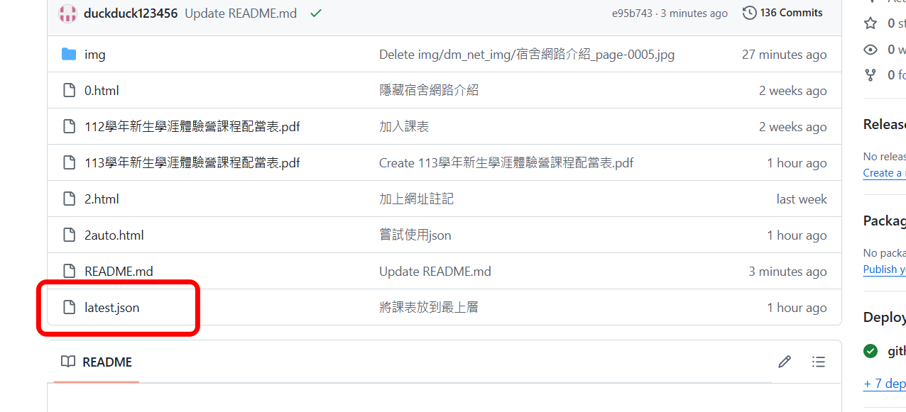
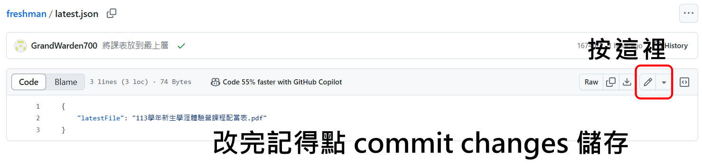

# 如何替換新生體驗營課表?

## 步驟

### 1. 上傳當年最新課表
請將當年最新的課表 PDF 檔案上傳至指定的 GitHub 儲存庫。

**路徑:**
```
Add file --> Upload files --> 將檔案拖放上來 --> Commit changes
(按鈕)       (按鈕)            (上傳檔案)        (綠色按鈕)

```


### 2. 修改 `latest.json` 中指定的檔案

- 打開 `latest.json` 檔案。
- 找到 `"latestFile"` 這個欄位，並將其對應的檔名修改為最新課表的 PDF 檔名。

#### 範例:
如果原本的課表檔名是 `113學年新生學涯體驗營課程配當表.pdf`，但今年要改成 `114學年新生學涯體驗營課程配當表.pdf`，將修改 `latest.json` 如下：

```json
{
    "latestFile": "114學年新生學涯體驗營課程配當表.pdf"
}
```


這樣，系統就會自動導向最新的課表。

### 3. 等待1~2分鐘，讓GitHub系統自動更新。


