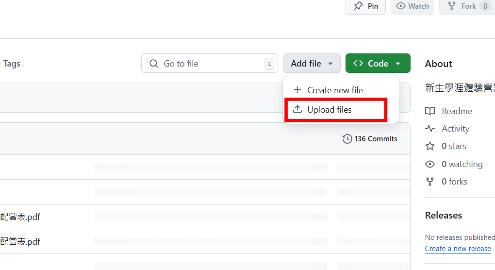
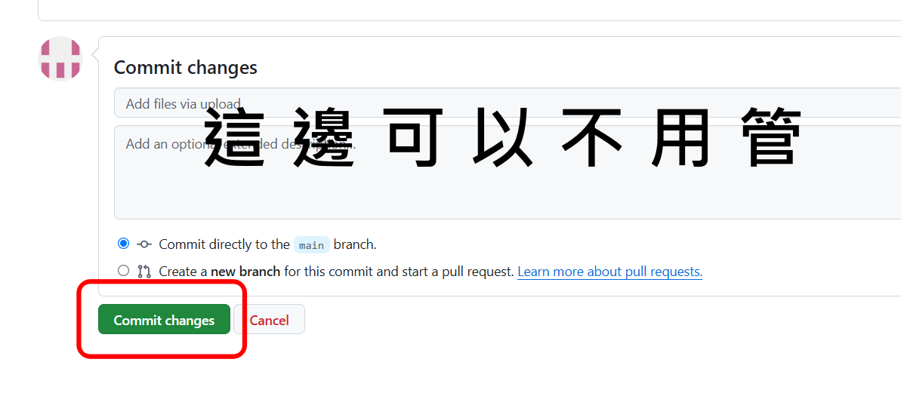
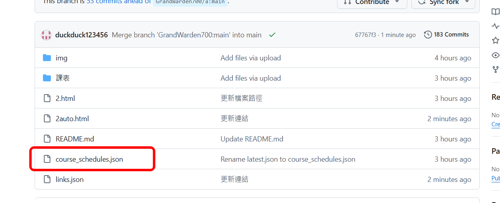
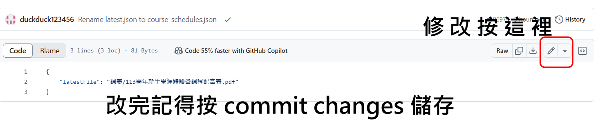
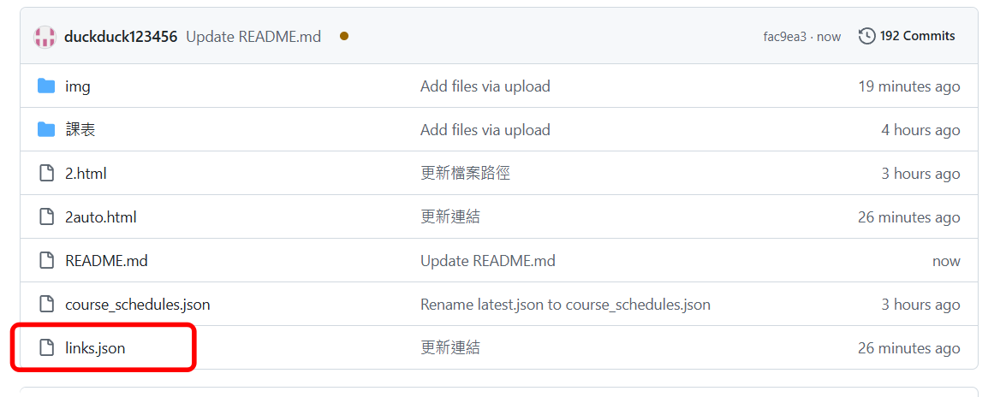
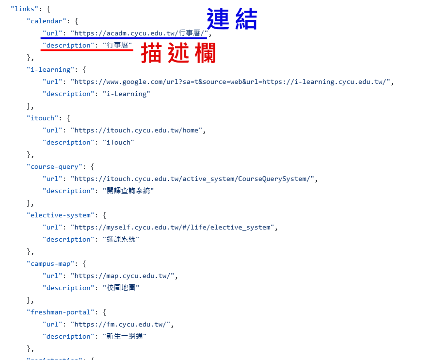

___
# 如何替換新生體驗營課表?

## 步驟

### 1. 上傳當年最新課表
請將當年最新的課表 PDF 檔案上傳至「課表」資料夾。

**路徑:**
```
點兩下「課表」進入資料夾 --> Add file --> Upload files --> 將檔案拖放上來 --> Commit changes
                       (按鈕)       (按鈕)            (上傳檔案)        (綠色按鈕)
```
   ---

   ---

   ---

### 2. 修改 `course_schedules.json` 中指定的檔案

- 打開 `course_schedules.json` 檔案。
- 找到 `"latestFile"` 這個欄位，並將其對應的檔名修改為最新課表的 PDF 檔名。
- `課表`的資料夾，專門存放新生學涯體驗營的課表。

#### 範例:
如果原本的課表檔名是 `113學年新生學涯體驗營課程配當表.pdf`，但今年要改成 `114學年新生學涯體驗營課程配當表.pdf`，將修改 `course_schedules.json` 如下：

```json
{
    "latestFile": "課表/114學年新生學涯體驗營課程配當表.pdf"
}
```
   ---

   ---

   ---
這樣，系統就會自動導向最新的課表。

### 3. 等待1~2分鐘，讓GitHub系統自動更新。

___
# 如何修改網頁內的對應連結?

## 步驟
1. **點擊 links.json 進入檔案**  
   在 GitHub 上，找到 `links.json` 並點擊進入。
   ---
   
   ---

3. **修改對應的連結**  
   每個連結都有對應的 `description`（描述欄），可以根據描述找到對應的連結，並修改 `url` 欄位的內容。
   ---
   
   ---

5. **儲存修改內容**  
   完成修改後，點擊「Commit changes」儲存更改，更改會立即生效。

